# 📚 Book Summarization Agent Workflow

This repository contains an n8n workflow for an AI-powered Book Summarization agent that automates the entire process of document processing - from upload detection to final summary delivery.


 
## ✨ Features

- 🔍 **Automatic Detection**: Monitors Google Drive folder for new PDF/TXT uploads
- 📄 **Smart Extraction**: Extracts text content from various document formats
- ✂️ **Intelligent Chunking**: Splits large texts into optimal chunks for AI processing
- 🧠 **AI Summarization**: Uses Mistral AI to generate comprehensive summaries
- ☁️ **Cloud Integration**: Seamlessly integrates with Google Drive for file management
- 🔄 **Fully Automated**: End-to-end automation with zero manual intervention

---

## 🚀 Quick Start

### Prerequisites

Before setting up the workflow, ensure you have:

- ✅ Active n8n instance (self-hosted or cloud)
- ✅ Google Drive account with API access enabled
- ✅ Mistral Cloud API account with valid credentials
- ✅ Google Drive folder ID for monitoring uploads

### Installation Steps

#### 1. Clone the Repository
```bash
git clone https://github.com/YourGitHubUsername/book-summarization-agent.git
cd book-summarization-agent
```

#### 2. Import Workflow into n8n

1. Open your n8n instance
2. Navigate to **Workflows** → **New** → **Import from JSON**
3. Upload the `book-summarization.json` file from this repository
4. Wait for the import confirmation

#### 3. Configure API Credentials

Set up the following credentials in your n8n instance:

| Service | Credential Name | Usage |
|---------|----------------|--------|
| **Google Drive** | `Google Drive account 2` | File monitoring & upload operations |
| **Mistral AI** | `Mistral Cloud account` | Text summarization processing |

> ⚠️ **Critical**: Verify all credentials are properly linked before activation

#### 4. Activate the Workflow

1. Review the imported workflow configuration
2. Test the credential connections
3. **Activate** the workflow to begin monitoring

---

## 🏗️ Workflow Architecture

### Processing Pipeline Overview

```mermaid
graph TD
    A[📥 Google Drive Trigger] --> B[💾 Download File]
    B --> C[📄 Extract Text Content]
    C --> D[✂️ Chunk Text]
    D --> E[🧠 AI Summarization]
    E --> F[📝 Combine Summaries]
    F --> G[⬆️ Upload to Drive]
    
    style A fill:#e1f5fe
    style E fill:#f3e5f5
    style G fill:#e8f5e8
```



### Detailed Node Breakdown

#### 1. 📥 Google Drive Trigger
**Entry Point**: Continuously monitors designated folder

```yaml
Configuration:
  Trigger Type: specificFolder
  Folder ID: 1_cyKjfzwZHPJfKO728h7C3caclGZRjBN
  Event: fileCreated
  Output: File metadata (ID, name, MIME type)
```

#### 2. 💾 Download File (Google Drive)
**File Retrieval**: Downloads detected files for processing

```yaml
Operation: download
File ID: ={{ $json["id"] }}
Output: Binary file content (PDF/TXT)
```

#### 3. 📄 Extract from File
**Content Extraction**: Converts files to readable text

```yaml
Operation: pdf
Supported Formats: PDF, TXT
Output: Raw extracted text content
```

#### 4. ✂️ Code (Chunking)
**Text Segmentation**: Breaks large content into processable chunks

```javascript
// Custom chunking logic
const chunkSize = 1000; // Configurable
const chunks = splitTextIntoChunks(text, chunkSize);
// Output: Array of text chunks
```

#### 5. 🧠 Basic LLM Chain (Mistral Cloud)
**AI Processing**: Generates summaries using Mistral AI

```yaml
Prompt Template: |
  Summarize the following text concisely and accurately:
  
  Text: {{ $json["chunk"] }}
  
Model: Mistral Cloud Chat Model
Output: Individual chunk summaries
```

#### 6. 📝 Code1 (Combine & Prepare Output)
**Summary Assembly**: Merges all summaries into final document

```javascript
// Combination logic
const finalSummary = summaries.join('\n\n');
const binaryOutput = {
  data: Buffer.from(finalSummary).toString('base64'),
  mimeType: 'text/plain',
  fileName: 'summary.txt'
};
```

#### 7. ⬆️ Upload file (Google Drive)
**Final Delivery**: Saves completed summary to Google Drive

```yaml
Input: Binary summary file
Filename: summary.txt
Target: Same monitored folder
Output: Uploaded file ID
```

---

## 🔧 Configuration & Customization

### Essential Settings

#### Folder Configuration
```yaml
# Recommended: Use Shared Drive IDs for enterprise setups
MONITOR_FOLDER_ID: "your-google-drive-folder-id"
OUTPUT_FOLDER_ID: "same-or-different-folder-id"
```

#### Chunking Parameters
```javascript
// Adjust based on your LLM's context window
const CHUNK_SIZE = 1000;        // Characters per chunk
const CHUNK_OVERLAP = 100;      // Overlap between chunks
```

#### Summarization Prompt
```yaml
# Customize the summarization prompt for your needs
prompt: |
  Create a comprehensive summary of the following text.
  Focus on key concepts, main arguments, and important details.
  
  Text: {{ $json["chunk"] }}
```

### Advanced Customizations

- **File Type Support**: Extend to support DOCX, EPUB, etc.
- **Multiple AI Providers**: Switch between OpenAI, Anthropic, Mistral
- **Output Formats**: Generate PDF summaries, structured JSON, etc.
- **Notification System**: Add email/Slack notifications on completion

---

## 🛠️ Troubleshooting Guide

### Common Issues & Solutions

#### Authentication Errors
```bash
# Google Drive API Issues
- Verify OAuth2 credentials are properly configured
- Check folder permissions and sharing settings
- Ensure service account has necessary drive access

# Mistral AI Issues  
- Validate API key is active and has sufficient credits
- Check rate limiting and quota restrictions
```

#### Processing Failures
```bash
# File Processing Issues
- Confirm supported file formats (PDF, TXT)
- Check file size limits and processing timeouts
- Verify text extraction is working correctly

# Chunking Problems
- Adjust chunk size for your content type
- Monitor memory usage for large documents
```

#### Upload Issues
```bash
# Google Drive Upload Failures
- Verify write permissions to target folder
- Check available storage quota
- Ensure proper file naming conventions
```

### Debug Mode
Enable detailed logging in n8n settings to monitor:
- Node execution times
- Data flow between nodes  
- Error messages and stack traces

---

## 📊 Performance Metrics

### Typical Processing Times
| Document Size | Processing Time | Chunks Generated |
|--------------|----------------|------------------|
| 50 pages     | 2-3 minutes    | 15-20 chunks     |
| 100 pages    | 4-6 minutes    | 30-40 chunks     |
| 200 pages    | 8-12 minutes   | 60-80 chunks     |

### Resource Usage
- **Memory**: ~100MB per active workflow
- **API Calls**: 1 call per chunk to Mistral AI
- **Storage**: Minimal temporary storage usage

### Development Setup
1. Fork the repository
2. Create a feature branch
3. Test your changes thoroughly
4. Submit a pull request
